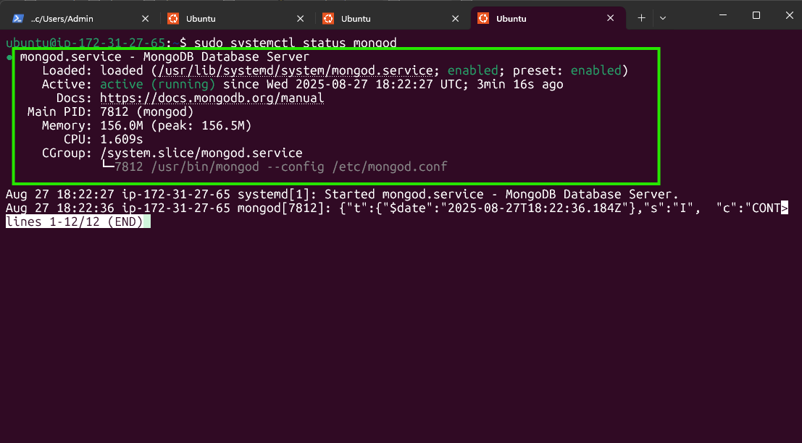
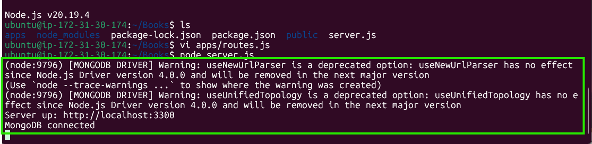
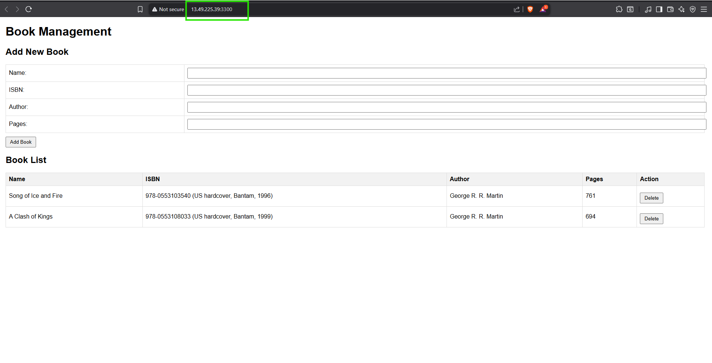

---

# Book Register Application (Node.js + Express + AngularJS + MongoDB)

This project demonstrates a simple **Book Management Web Application** built using:

* **Node.js / Express** for backend APIs
* **MongoDB** for data persistence
* **AngularJS** for frontend UI

---

## Step 1: Install Node.js

Node.js is a JavaScript runtime built on Chrome's V8 engine. It will be used to set up Express routes and serve AngularJS frontend files.

```bash
# Update Ubuntu
sudo apt update

# Upgrade Ubuntu
sudo apt upgrade -y

# Install certificates & tools
sudo apt -y install curl dirmngr apt-transport-https lsb-release ca-certificates

# Add Node.js repo (Node 18 LTS recommended)
curl -sL https://deb.nodesource.com/setup_18.x | sudo -E bash -

# Install Node.js
sudo apt install -y nodejs
```

Verify installation:

```bash
node -v
npm -v
```

---

## Step 2: Install MongoDB

We’ll use MongoDB as our database.

```bash
# Import MongoDB public GPG key
curl -fsSL https://pgp.mongodb.com/server-7.0.asc | \
sudo gpg -o /usr/share/keyrings/mongodb-server-7.0.gpg \
--dearmor

# Create list file for MongoDB
echo "deb [ arch=amd64,arm64 signed-by=/usr/share/keyrings/mongodb-server-7.0.gpg ] https://repo.mongodb.org/apt/ubuntu noble/mongodb-org/7.0 multiverse" | \
sudo tee /etc/apt/sources.list.d/mongodb-org-7.0.list

# Update and install MongoDB
sudo apt update
sudo apt install -y mongodb-org

# Start and enable MongoDB service
sudo systemctl start mongod
sudo systemctl enable mongod
```

Check status:

```bash
systemctl status mongod
```



---

## Step 3: Clone / Setup Project

Navigate to home directory and set up project folder.

```bash
cd ~
mkdir Books && cd Books
npm init -y
npm install express mongoose body-parser
```

Create **server.js** file for backend routes:

```js
const express = require('express');
const bodyParser = require('body-parser');
const mongoose = require('mongoose');
const path = require('path');

const app = express();
const port = 3300;

// Middleware
app.use(bodyParser.json());
app.use(express.static(path.join(__dirname, 'public')));

// MongoDB connection
mongoose.connect('mongodb://localhost:27017/bookdb', {
  useNewUrlParser: true,
  useUnifiedTopology: true
});

// Book Schema
const BookSchema = new mongoose.Schema({
  name: String,
  isbn: String,
  author: String,
  pages: Number
});
const Book = mongoose.model('Book', BookSchema);

// Routes
app.get('/book', async (req, res) => {
  const books = await Book.find();
  res.json(books);
});

app.post('/book', async (req, res) => {
  const newBook = new Book(req.body);
  await newBook.save();
  res.json(newBook);
});

app.delete('/book/:isbn', async (req, res) => {
  await Book.deleteOne({ isbn: req.params.isbn });
  res.json({ message: 'Book deleted' });
});

// Fallback route (SPA support)
app.use((req, res) => {
  res.sendFile(path.join(__dirname, 'public', 'index.html'));
});

// Start server
app.listen(port, () => {
  console.log(`Server running on http://localhost:${port}`);
});
```

---

## Step 4: Set Up AngularJS Frontend

Inside `Books` folder:

```bash
mkdir public && cd public
```

Create **script.js**:

```js
angular.module('myApp', [])
  .controller('myCtrl', function($scope, $http) {
    function fetchBooks() {
      $http.get('/book').then(response => {
        $scope.books = response.data;
      });
    }

    fetchBooks();

    $scope.add_book = function() {
      const newBook = {
        name: $scope.Name,
        isbn: $scope.Isbn,
        author: $scope.Author,
        pages: $scope.Pages
      };
      $http.post('/book', newBook).then(() => {
        fetchBooks();
        $scope.Name = $scope.Isbn = $scope.Author = $scope.Pages = '';
      });
    };

    $scope.del_book = function(book) {
      $http.delete(`/book/${book.isbn}`).then(() => {
        fetchBooks();
      });
    };
  });
```

Create **index.html**:

```html
<!DOCTYPE html>
<html ng-app="myApp" ng-controller="myCtrl">
<head>
  <title>Book Management</title>
  <script src="https://ajax.googleapis.com/ajax/libs/angularjs/1.8.2/angular.min.js"></script>
  <script src="script.js"></script>
</head>
<body>
  <h1>Book Management</h1>
  
  <h2>Add New Book</h2>
  <form ng-submit="add_book()">
    <input type="text" ng-model="Name" placeholder="Name" required>
    <input type="text" ng-model="Isbn" placeholder="ISBN" required>
    <input type="text" ng-model="Author" placeholder="Author" required>
    <input type="number" ng-model="Pages" placeholder="Pages" required>
    <button type="submit">Add Book</button>
  </form>

  <h2>Book List</h2>
  <table border="1">
    <tr><th>Name</th><th>ISBN</th><th>Author</th><th>Pages</th><th>Action</th></tr>
    <tr ng-repeat="book in books">
      <td>{{book.name}}</td>
      <td>{{book.isbn}}</td>
      <td>{{book.author}}</td>
      <td>{{book.pages}}</td>
      <td><button ng-click="del_book(book)">Delete</button></td>
    </tr>
  </table>
</body>
</html>
```

---

## Step 5: Run the Application

From project root (`Books`):

```bash
node server.js
```
If successful, you'll see:



---

## Step 6: Access from Browser

1. Open **port 3300** in your AWS Security Group.

   * Go to AWS EC2 Console → Security Groups → Inbound rules → Add Rule:

     * Type: **Custom TCP**
     * Port Range: **3300**
     * Source: **0.0.0.0/0** (for testing)
2. Get server IP:

   ```bash
   curl -s http://169.254.169.254/latest/meta-data/public-ipv4
   ```
3. Visit in browser:

   ```
   http://<your-public-ip>:3300
   ```

You should now see the **Book Management UI** 🎉



---

## Step 7: (Optional) Keep App Running with PM2

Install PM2:

```bash
sudo npm install -g pm2
```

Start app:

```bash
pm2 start server.js --name book-app
pm2 startup
pm2 save
```

This ensures the app stays running after logout or reboot.

---

